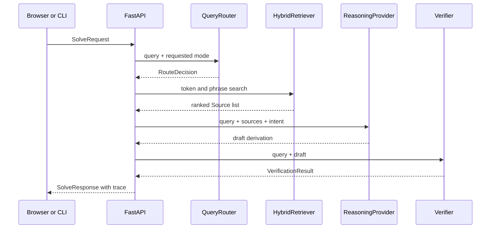

# EulerGraph-Agent Architecture

## Scope

EulerGraph-Agent is a bounded orchestration system for mathematical question answering. It is not a claim that natural-language generation alone constitutes proof. Its architecture separates retrieval, synthesis, and verification so each layer can be replaced or audited independently.

## Request lifecycle



## Boundaries

### API boundary

`app/main.py` contains transport concerns only. Pydantic models in `app/models.py` are the contract. This allows a future React client, notebook client, or external service to consume the same response without importing internal classes.

### Routing boundary

`app/router.py` produces a frozen `RouteDecision`. The current policy is deterministic and inspectable. Explicit mode takes priority over inferred intent. A future classifier may be introduced as a second implementation, but it should preserve the same fields and fallback to deterministic routing if unavailable.

### Retrieval boundary

`app/retrieval.py` stores normalized document records and returns public `Source` objects. The current score uses three signals:

- Query term coverage: proportion of unique query tokens found in a document.
- Frequency proxy: repeated matching terms contribute diminishing evidence.
- Exact phrase bonus: the full query appearing in a document receives a small boost.

The formula is bounded and deterministic. It is suitable for a local corpus and test fixtures. It is not a dense embedding model and should not be described as one in production documentation.

### Provider boundary

`ReasoningProvider.answer` is asynchronous so a network-backed model can be inserted without changing the graph. The local fallback is intentionally conservative and gives useful templates for common calculus, linear algebra, and Euler queries. The `remote` flag only reports that credentials exist; it does not pretend an external request has succeeded.

### Verification boundary

`app/verifier.py` returns a dataclass that is converted at the API edge into `Verification`. A verifier may return `verified` only when a concrete check has passed. A proof-shaped answer without a formal proof backend remains `partial`.

## State model

The current graph keeps state in local variables because the execution is one-shot. The conceptual state is:

```text
QueryState {
  request: SolveRequest
  route: RouteDecision
  sources: list[Source]
  draft: str
  verification: VerificationResult
  trace: list[Step]
  export: str
}
```

A LangGraph migration can map each field to a typed graph state. Suggested nodes are `route`, `decompose`, `retrieve`, `draft`, `symbolic_check`, `critique`, `retry_retrieve`, and `render`. The public response does not need to change.

## Data lifecycle

The bundled JSON file is both a seed fixture and a local persistence layer. Ingestion validates the Pydantic shape, generates a stable slug, resolves duplicate ids with numeric suffixes, and writes the complete file. The ingestion utility can split Markdown headings and long sections into manageable chunks before indexing.

For a production corpus, replace the file writer with a transactional repository. Keep an immutable source id, a content hash, timestamps, collection name, and provenance fields. Never rely on a title as the only identity once multiple editions or translations exist.

## Failure behavior

- No retrieval hits: the provider explains that evidence is missing rather than inventing a citation.
- No remote keys: the deterministic fallback remains available.
- Proof without formal backend: verification is `partial`.
- Invalid input: FastAPI and Pydantic return a structured 422 response.
- Unsupported import suffix: the CLI raises a clear validation error.
- Duplicate title: ingestion keeps both documents with distinct ids.

## Scaling path

1. Add a repository interface around `HybridRetriever`.
2. Add an embedding worker and Qdrant adapter.
3. Add a queue for long-running indexing and solving.
4. Persist graph runs and source snapshots in a relational database.
5. Add authentication, tenant isolation, quotas, and rate limits.
6. Move symbolic work to a resource-limited worker.
7. Add Lean proof compilation as a separate trust boundary.
8. Add OpenTelemetry spans around route, retrieval, provider, and verification.

The order matters: correctness and provenance should be established before adding concurrency or model scale.
